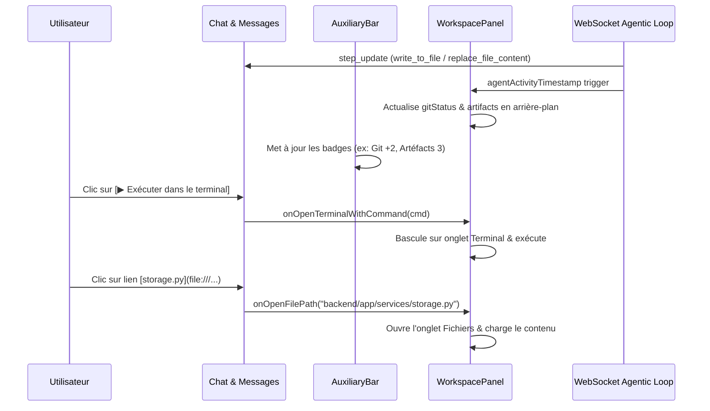

# Spécification de Conception : Expérience Cockpit & Volet Auxiliaire Façon Antigravity IDE

**Date** : 2026-09-22  
**Statut** : Validé par l'utilisateur  
**Auteur** : Antigravity Pair Programmer & User  

---

## 1. Contexte & Objectif

La WebUI d'Antigravity est le portail central pour exécuter et superviser les tâches agentiques. Pour élever l'expérience utilisateur au niveau de l'**Antigravity IDE** officiel (basé sur VS Code) et d'**Antigravity 2.0**, cette évolution introduit un **environnement de travail unifié (Cockpit IDE)** qui intègre :
1. Une **Barre d'Activité Auxiliaire** latérale droite (`Auxiliary Bar`) rétractable en 1 clic.
2. Un **Volet Auxiliaire Multi-Vues** (`WorkspacePanel`) avec suivi en temps réel :
   - Diffs et modifications de code de la session en direct (`git`).
   - Explorateur d'artéfacts auto-rafraîchi (`artifacts`).
   - Arborescence de fichiers et éditeur de code (`files`).
   - Terminal interactif multi-sessions (`terminal`).
   - Suivi Kanban des tâches (`kanban`).
3. Des **Lentilles de Code (Code Lenses)** au-dessus des blocs de code dans le chat :
   - Exécution directe de commandes dans le terminal en 1 clic.
   - Ouverture directe des fichiers modifiés dans l'éditeur.
   - Interception des clics sur les liens de fichiers Markdown locaux pour les afficher dans le volet auxiliaire.
4. Une **Synchronisation Réactive en Direct** (WebSocket) avec les étapes de l'agent.

---

## 2. Architecture & Composants Frontend

### 2.1. Barre d'Activité Auxiliaire (`AuxiliaryBar.tsx`)
- **Position** : Bande verticale étroite (~48px) sur le flanc droit de l'écran, visible sur écran moyen et large (`md:`).
- **Icônes & Rôles** :
  - `FolderTree` : Onglet **Fichiers** (`files`).
  - `GitBranch` : Onglet **Modifications & Diffs** (`git`) avec badge des fichiers touchés.
  - `FileText` : Onglet **Artéfacts** (`artifacts`) avec badge du compte d'artéfacts.
  - `Terminal` : Onglet **Terminal** (`terminal`).
  - `Kanban` : Onglet **Kanban** (`kanban`).
- **Comportement Toggle** :
  - Si le volet est fermé : un clic sur une icône ouvre le volet sur cet onglet.
  - Si le volet est ouvert sur l'onglet cliqué : le volet se rétracte.
  - Si le volet est ouvert sur un autre onglet : bascule instantanée sans fermer le volet.
- **Raccourci clavier** : `Ctrl+B` / `Cmd+B` pour basculer l'affichage du volet auxiliaire.
- **Persistance** : Mémorisation dans `localStorage` (`antigravity_aux_panel_open`, `antigravity_aux_panel_width`).

### 2.2. Volet Auxiliaire Réactif (`WorkspacePanel.tsx`)
- **Redimensionnement fluide** : Barre de drag (`col-resize`) à gauche du volet pour ajuster la largeur entre 360px et 55% de la largeur d'écran.
- **Synchronisation en direct (Live Agent Sync)** :
  - Écoute du prop `agentActivityTimestamp` mis à jour par les événements WebSocket (`step_update`, fin d'outils `write_to_file`, `replace_file_content`, etc.).
  - Actualisation automatique silencieuse du statut Git et de la liste des artéfacts.
  - Si l'utilisateur regarde un artéfact ou un diff en cours de modification, rechargement automatique du rendu sans recharger toute l'arborescence.

### 2.3. Lentilles d'Actions sur Blocs de Code (`CodeBlockLenses`)
- Au sommet de chaque bloc de code dans `ChatCanvas.tsx` :
  - **Commandes shell (`bash`, `sh`, `powershell`, `cmd`)** :
    - Bouton **`[▶ Exécuter dans le terminal]`** : active l'onglet `terminal`, initialise la session shell si nécessaire et injecte la commande.
    - Bouton **`[📋 Copier]`** : copie dans le presse-papier avec confirmation visuelle.
  - **Fichiers sources (`ts`, `js`, `py`, `html`, `css`, `json`, `sql`, etc.)** :
    - Si un chemin de fichier relatif est détecté dans le premier commentaire ou l'entête : bouton **`[📁 Ouvrir dans l'éditeur]`** ouvrant directement le fichier dans l'onglet `files`.
    - Bouton **`[📋 Copier le code]`**.

### 2.4. Interception des Liens de Fichiers Locaux dans le Chat
- Dans le composant de rendu Markdown de `ChatCanvas.tsx`, intercepter les balises `<a>` pointant vers `file:///...` ou des chemins relatifs du workspace :
  - Empêcher la navigation vers une page blanche du navigateur.
  - Extraire le chemin relatif au workspace et invoquer `onOpenFileInWorkspace(path)`.
  - Ouvrir instantanément le fichier dans l'éditeur de `WorkspacePanel`.

---

## 3. Flux de Données & Événements

---

## 4. Plan de Test & Vérification

### Tests Automatisés
- `npx tsc --noEmit` : validation stricte du typage TypeScript de l'ensemble des nouveaux composants et interfaces.
- `npm run lint` : respect des règles de style oxlint (0 warning, 0 error).
- `npm run build` : validation de la compilation du bundle de production Vite.

### Tests Manuels & Fonctionnels
1. **Auxiliary Bar** : Cliquer sur chaque icône de la barre latérale et vérifier la bascule immédiate, l'animation et la rétractation en recliquant.
2. **Badges dynamiques** : Vérifier que le badge Git s'incrémente lorsque des fichiers sont modifiés et que le badge Artéfacts affiche le compte exact.
3. **Redimensionnement & Mémorisation** : Glisser la poignée de redimensionnement et rafraîchir la page pour confirmer la persistance de la largeur.
4. **Code Lenses** :
   - Tester le bouton `[▶ Exécuter dans le terminal]` sur une commande shell.
   - Tester le bouton `[📁 Ouvrir dans l'éditeur]` sur un bloc de code.
   - Tester le clic sur un lien `file:///...` dans un message et constater l'ouverture dans le panneau latéral.
