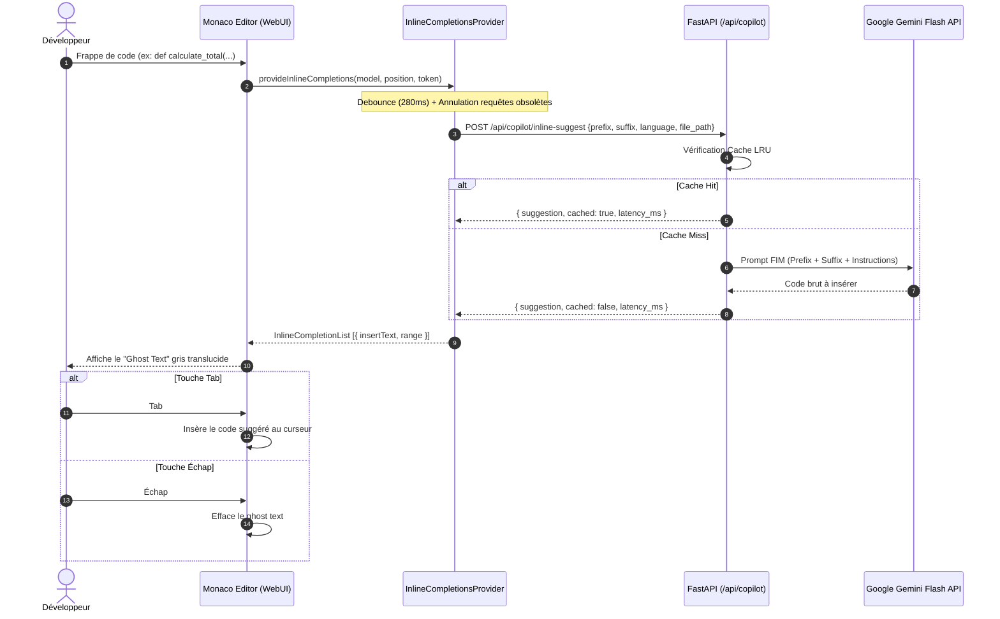

# Spécification de Conception — Sprint 15 (v0.2.19)
# AI Inline Copilot & Ghost Text Actions dans Monaco Studio

## 1. Vue d'Ensemble & Objectifs

L'objectif du Sprint 15 est d'intégrer une expérience de saisie assistée par intelligence artificielle de premier ordre dans **Monaco Studio** et l'**Explorateur Workspace** d'Antigravity WebUI, inspirée de GitHub Copilot et Cursor :
1. **Complétion "Ghost Text" en temps réel** : Pendant que le développeur tape du code, une suggestion grisée semi-transparente apparaît directement à la suite du curseur.
2. **Acceptation & Rejet fluides** : Appuyer sur `Tab` insère instantanément le code suggéré ; appuyer sur `Échap` ou continuer la frappe le rejette sans friction.
3. **Moteur Hybride Ultra-Rapide** : Utilisation du modèle le plus réactif (`Gemini 2.5/3.8 Flash`) avec un prompt optimisé *Fill-In-The-Middle* (FIM), un debounce adaptatif de 250-300 ms et un cache mémoire LRU pour un retour sous les 350-400 ms.
4. **Code Actions Contextuelles en 1 Clic** : Barre d'actions IA flottante ou de barre d'outils pour la sélection active :
   - ⚡ **Refactoriser** : Simplification et nettoyage du code sélectionné.
   - 🔷 **Générer Types** : Inférence d'interfaces TypeScript ou modèles Pydantic.
   - 📝 **Documenter** : Génération de JSDoc / Docstring complète.
   - 🧪 **Générer Tests** : Création automatique du squelette de tests unitaires (Vitest / Pytest).
   - Prévisualisation directe dans Monaco Diff avant application.

---

## 2. Architecture & Flux de Données



---

## 3. Spécifications Détaillées des Composants

### 3.1. Backend FastAPI (`backend/app/api/copilot.py`)

#### A. Endpoint `POST /api/copilot/inline-suggest`
- **Payload Request**:
  ```python
  class InlineSuggestRequest(BaseModel):
      prefix: str              # Code avant le curseur (jusqu'à 2000 caractères)
      suffix: str = ""         # Code après le curseur (jusqu'à 800 caractères)
      language: str            # ex: "typescript", "python", "javascript"
      file_path: Optional[str] = None
      max_tokens: int = 120
      temperature: float = 0.2
  ```
- **Payload Response**:
  ```python
  class InlineSuggestResponse(BaseModel):
      suggestion: str          # Code exact à insérer sans balises markdown
      cached: bool = False
      latency_ms: float
      model: str
  ```
- **Logique FIM (Fill-In-The-Middle)** :
  - Prompt système strict : *"Tu es un moteur de complétion de code en temps réel (Ghost Text Copilot). Complète le code situé exactement entre <PREFIX> et <SUFFIX>. Renvoie STRICTEMENT le code à insérer au point de coupure, sans aucune balise markdown (pas de ```), sans préambule, sans commentaires superflus."*
  - Nettoyage automatique des backticks éventuels (` ``` `) si l'IA en génère.
  - Cache LRU mémoire de 256 entrées basé sur le hachage du préfixe récent, suffixe et langage.

#### B. Endpoint `POST /api/copilot/action`
- **Payload Request**:
  ```python
  class CopilotActionRequest(BaseModel):
      action: str              # "refactor", "types", "docstring", "tests"
      code: str                # Code sélectionné ou fonction courante
      language: str
      file_path: Optional[str] = None
      user_instruction: Optional[str] = None
  ```
- **Payload Response**:
  ```python
  class CopilotActionResponse(BaseModel):
      action: str
      result_code: str
      explanation: str
      diff: Optional[str] = None
  ```

#### C. Endpoint `GET /api/copilot/status`
- Vérifie la disponibilité des clés d'authentification Google ou du runtime Antigravity pour informer l'interface si Copilot est prêt.

---

### 3.2. Frontend : Moteur Monaco Inline Completion (`frontend/src/services/copilot.ts`)

- **Fonction `registerCopilotInlineProvider(monaco, options)`**:
  - Enregistre `monaco.languages.registerInlineCompletionsProvider` pour tous les langages pris en charge ou `'*'` / liste d'extensions.
  - **Debounce 280ms** : Utilise un timer pour attendre l'inactivité de frappe.
  - **Gestion de `cancellationToken`** : Si l'utilisateur tape une nouvelle touche avant la fin de l'appel réseau, la promesse est rejetée proprement et la requête HTTP annulée via `AbortController`.
  - **Respect du contexte** : Ignore les positions au milieu d'une chaîne fermée ou d'un commentaire mono-ligne sauf si la ligne commence par un pattern de déclenchement (ex: `// TODO:`, `/*`, `# compute`).

- **Options de l'Éditeur Monaco**:
  ```typescript
  inlineSuggest: {
    enabled: isCopilotEnabled,
    mode: 'subsequent',
    showToolbar: 'onHover',
  }
  ```

---

### 3.3. Interface Utilisateur & Intégration Visuelle

1. **Badge d'état Copilot dans la barre d'outils**:
   - Bouton de bascule `⚡ Copilot: Actif` / `En pause` avec raccourci clavier `Alt+C` ou clic rapide.
   - Témoin d'activité (vert quand prêt, clignotant ambre pendant la génération, bleu après complétion).
2. **Menu Flottant d'Actions IA (Quick Code Actions)**:
   - Déclenché via le bouton `Actions IA` dans la barre Code Lens ou via sélection de texte :
     - ⚡ **Refactoriser** : Affiche un diff dans Monaco Studio Modal avant validation.
     - 🔷 **Types TypeScript / Pydantic** : Génère les définitions de types manquantes.
     - 📝 **Générer Docstring** : Ajoute la documentation formatée selon le standard du langage.
     - 🧪 **Générer Tests Unitaires** : Produit le fichier de tests associé avec assertions.
3. **Persistance des Préférences**:
   - Sauvegarde dans `localStorage` (`antigravity_copilot_enabled`, `antigravity_copilot_debounce`).

---

## 4. Matrice de Tests & Validation

1. **Tests Backend Pytest (`backend/tests/test_copilot.py`)**:
   - Test de l'endpoint `/api/copilot/inline-suggest` avec mock et vérification du nettoyage des balises Markdown.
   - Test du cache LRU : second appel identique renvoie `cached: True` et latence quasi-nulle.
   - Test des 4 actions de code (`refactor`, `types`, `docstring`, `tests`).
   - Test de gestion des erreurs (texte vide, langage non supporté).
2. **Contrôles Qualité Stricts**:
   - Oxlint : `0 warning, 0 error`.
   - TypeScript : `npx tsc -b` réussi sans erreur.
   - Production Build : `npm run build` propre et optimisé.
3. **Vérification Interactive Chrome DevTools MCP**:
   - Test de frappe dans Monaco Studio avec apparition du Ghost Text.
   - Test d'acceptation par `Tab` et rejet par `Échap`.
   - Test d'exécution d'une Code Action avec aperçu Diff.
   - Capture d'écran `monaco_copilot_ghost_text.png` et `monaco_copilot_code_actions.png`.
