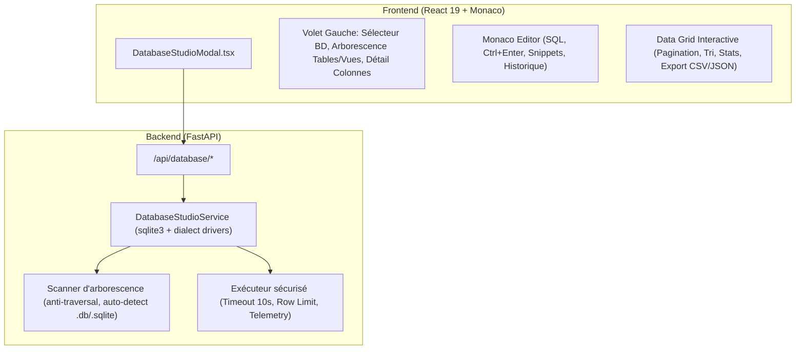

# Design Spec: Database Explorer & Visual SQL Query Studio

**Author**: Antigravity Assistant  
**Date**: 2026-09-26  
**Status**: Approved  
**Milestone**: v0.4.0 (Roadmap)

---

## 1. Overview & Objectives

The **Database Explorer & Visual SQL Query Studio** introduces a unified, developer-grade database browser and SQL workbench directly inside the Antigravity WebUI. It allows developers to:
1. Automatically discover and connect to SQLite databases (`.db`, `.sqlite`, `.sqlite3`) residing in their active workspaces without manual configuration.
2. Connect to local or remote database instances (SQLite, and optionally PostgreSQL, MySQL via connection strings).
3. Introspect database schemas in real time (tables, views, column data types, primary keys, nullability, foreign keys, row estimates).
4. Author, execute, and debug SQL queries with a dedicated Monaco Editor (`language="sql"`) featuring syntax highlighting, `Ctrl+Enter` execution, query history, and table snippets.
5. Inspect results in an interactive data grid with column sorting, responsive pagination, row counts, execution duration telemetry, and instant 1-click export to `CSV` and `JSON`.

---

## 2. Architecture & Components

---

## 3. Backend API Specifications

### 3.1 Data Models (`app/services/database_studio.py`)
- `DatabaseConnectionInfo`:
  - `id`: `str` (unique hash or path slug)
  - `name`: `str` (filename or connection label)
  - `dialect`: `Literal["sqlite", "postgresql", "mysql"]`
  - `path`: `str | None`
  - `size_bytes`: `int | None`
  - `is_workspace_local`: `bool`
  - `table_count`: `int | None`
- `ColumnInfo`:
  - `name`: `str`
  - `type`: `str`
  - `primary_key`: `bool`
  - `nullable`: `bool`
  - `default_value`: `str | None`
- `TableInfo`:
  - `name`: `str`
  - `is_view`: `bool`
  - `columns`: `list[ColumnInfo]`
  - `row_count_estimate`: `int | None`
- `DatabaseSchema`:
  - `database_name`: `str`
  - `dialect`: `str`
  - `tables`: `list[TableInfo]`
- `QueryResult`:
  - `columns`: `list[str]`
  - `rows`: `list[list[Any]]`
  - `total_rows`: `int`
  - `truncated`: `bool`
  - `execution_time_ms`: `float`
  - `error`: `str | None`

### 3.2 Endpoints (`app/api/database_studio.py`)
1. `GET /api/database/discover`
   - Scans the active workspace for `.sqlite`, `.sqlite3`, `.db` files (excluding `.git`, `node_modules`, `venv`, `__pycache__`).
   - Returns a list of available `DatabaseConnectionInfo`.
2. `GET /api/database/schema?db_path=<path>`
   - Inspects the requested database and returns its tables, views, and columns.
3. `POST /api/database/query`
   - Payload: `{ "db_path": str, "query": str, "limit": int = 500 }`
   - Executes the query with a 10s timeout, limits results to `limit` rows (default 500, max 2000), and records execution duration.
4. `POST /api/database/export`
   - Payload: `{ "db_path": str, "query": str, "format": "csv" | "json" }`
   - Returns downloadable raw CSV or JSON.

---

## 4. Frontend Specifications

### 4.1 UI Layout (`DatabaseStudioModal.tsx`)
- **Header**:
  - Modal title: "Database Explorer & SQL Studio".
  - Quick status badge: Active database name, engine tag, file size.
  - Quick action buttons: Refresh, Close (`Esc`).
- **Split View**:
  - **Left Pane (280px)**:
    - Dropdown/List of discovered databases + "Ouvrir un autre fichier .sqlite".
    - Search input to filter tables.
    - Expandable list of Tables and Views.
    - Quick actions per table: `SELECT * FROM {table} LIMIT 50` on double click or button.
    - Column details on expansion (type badges, PK keys).
  - **Right Main Area**:
    - **Top Toolbar**: Run Query button (`Play` icon + `Ctrl+Entrée`), Clear, Recent Queries dropdown, Format SQL.
    - **Monaco SQL Editor**: Height ~200px, syntax highlighting, word wrap, font sized with app theme.
    - **Bottom Toolbar**: Row count, execution time in ms, Export CSV, Export JSON.
    - **Interactive Data Grid**:
      - Column headers with sorting (Asc/Desc).
      - Alternating row styling matching current skin (`OLED`, `Dark`, `Light`, `Ares`, etc.).
      - Empty state & error callouts for SQL syntax errors.
      - Pagination controls for queries returning > 50 rows.

### 4.2 Integration & Raccourcis
- Slash command: `/db`, `/database`, `/sql`.
- Button in Sidebar menu and quick access in Header Tools.
- Localized across all 15 languages (`locales.json`).

---

## 5. Security & Reliability
- Path Traversal Guard: Workspace databases must reside within the authorized filesystem path or explicitly verified safe user paths.
- Query Timeouts: Hard 10s ceiling on execution to prevent engine locks on massive tables.
- Read-only protection toggle: Prevents accidental mutations (`DROP`, `DELETE`) unless explicitly unflagged.
